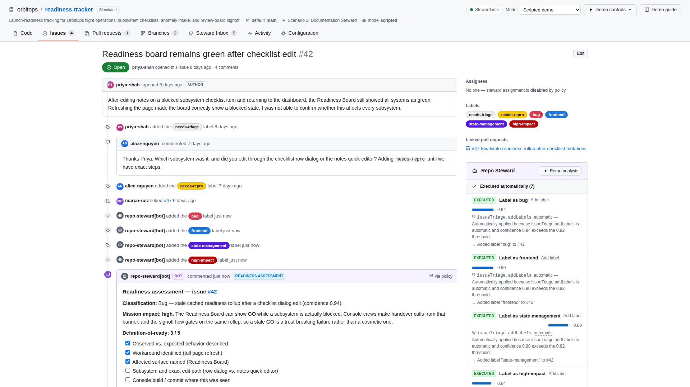

# Repo Steward

**An AI teammate for your repository — with authority decided by your team, not by the model.**

Repo Steward observes repository activity (issues opened, pull requests opened, merges landing), analyzes each event, and produces **structured action proposals**: labels, triage assessments, review comments, test-gap findings, documentation patches, draft PRs. A deterministic **policy engine**, configured by a committed `.repo-steward.yml`, decides for every proposal whether it executes automatically, waits for human approval in the **Steward Inbox**, or is blocked — and records exactly which rule decided.

> **The model proposes; deterministic software decides what is permitted.**

The primary product is a fully **simulated GitHub-style repository** — `orbitops/readiness-tracker`, a fictional launch-readiness tracker — that runs entirely in your browser: no GitHub account, no API key, no database. The same schemas, policy engine, and pipeline also power a safe, **dry-run-first adapter for real GitHub events**.



## Why this is “AI as a Teammate”

A teammate is not a chatbot you paste code into. A teammate:

- **has an ongoing role** — Repo Steward reacts to repository events (issue opened, PR opened, PR merged), not to chat prompts;
- **works inside the team's workflow** — its output is labels, timeline comments, review notes, branches, and draft PRs, in the places reviewers already look;
- **has bounded, legible authority** — every capability maps to one autonomy level (`disabled` / `propose` / `automatic`) in a reviewable config file, with confidence thresholds, path allowlists, and size limits enforced in code;
- **is accountable** — every event, proposal, policy decision, execution, approval, and rejection lands in an append-only audit log with the exact rule that applied ("Automatically applied because `issueTriage.addLabels` is automatic and confidence 0.94 exceeds the 0.82 threshold").

The demo is built so you can always distinguish the four layers: what the **analyzer proposed**, which **policy rules applied**, what the **policy engine decided**, and what **actually changed** in the repository.

## Hosted demo

A static build is published at **https://pcowhill.github.io/claude-repo-steward/**.
It runs the simulated repository with the **Scripted demo** and **Deterministic
mock** analyzers entirely in the browser. **Live AI** mode needs the backend
(and an API key), so it is unavailable on the hosted site — clone the repository
and follow the quick start below to use it.

## Quick start

```bash
npm install
npm run dev          # frontend on :5173 + backend on :8787 (one command)
```

Open http://localhost:5173 — you land directly in the simulated repository. No keys, no accounts.

| Script | What it does |
| --- | --- |
| `npm run dev` | Vite frontend + Express backend together |
| `npm run build` | Production build (`dist/`) |
| `npm test` | Vitest unit suite (83 tests) |
| `npm run test:e2e` | Playwright end-to-end suite (needs the dev server; the config starts it automatically) |
| `npm run verify` | typecheck + unit tests + build |
| `npm run steward -- --event <payload.json>` | Run the GitHub adapter pipeline on a webhook payload (dry-run) |

## The three demo scenarios

Load them from **Demo controls** in the header (clearly marked demo tooling — the buttons emit real repository events through the same pipeline as everything else).

1. **Issue Steward — issue #42** (“Readiness board remains green after checklist edit”). The steward classifies the bug, identifies the exact stale-cache code path in `src/state/readinessStore.ts`, posts a readiness assessment, clarifying questions and an implementation plan, and applies labels — while `ai-candidate` and `remove needs-repro` wait in the Inbox and assigning a developer is **blocked** by `safety.assignUsers`.
2. **Pull Request Steward — PR #47** (the fix for #42). Summary, linked-issue coverage, docs-impact assessment and a **test-gap finding** (the missing Playwright regression) post automatically; inline review comments wait for approval; approving and merging are blocked.
3. **Documentation Steward — merged PR #39** (the `deferred` checklist status). The steward detects that `docs/status-semantics.md` still describes the old semantics, prepares a bounded two-file patch (≤3 files, ≤200 lines, docs paths only), and asks for approval. Approving really creates branch `repo-steward/docs-pr-39`, a commit authored by `repo-steward[bot]`, and **draft PR #48** — all browsable. Rejecting creates nothing.

Rerun any scenario after changing the configuration and watch the same proposals land differently. Snapshot controls let you jump between *Before steward → After analysis → After policy → After execution*.

## Analysis modes

| Mode | Needs keys | What analyzes |
| --- | --- | --- |
| **Scripted demo** (default) | No | Deterministic, polished analysis for the three scenario targets, with believable pipeline latency. Uses the real policy engine and executors — only the “thinking” is canned. |
| **Deterministic mock** | No | Local rules over the actual content: keywords, existing labels, changed paths, docs mappings, test presence, definition-of-ready checks, computed confidences. Create or edit an issue and rerun — the result changes with the text. |
| **Live AI** | Yes | The backend calls Anthropic or OpenAI with a bounded context (issue/PR content, changed-file names, a few code excerpts, allowed labels/actions — never the whole repo), validates the JSON against the proposal schema, retries once with a repair instruction, and fails non-destructively otherwise. |

### Configuring Live AI (optional)

```bash
cp .env.example .env
# then set ONE provider:
# ANTHROPIC_API_KEY=sk-ant-...       ANTHROPIC_MODEL=claude-opus-4-8   (or another current model id)
# OPENAI_API_KEY=sk-...              OPENAI_MODEL=gpt-4o-mini
npm run dev
```

Anthropic is preferred when both are configured. Keys live only in the backend process; `GET /api/ai/status` reports *whether* a provider is configured, never the key. Without keys, Live AI mode fails gracefully with a clear message and the other two modes are unaffected. In every mode — including Live AI — documentation patch bodies are produced by deterministic code, so model output can never write arbitrary file content.

## Editing `.repo-steward.yml`

The **Configuration** tab has a visual editor (grouped autonomy controls, confidence thresholds, documentation bounds, safety overrides) and a synchronized **YAML editor** with schema validation, useful error messages, a diff preview against the applied config, copy/download, and reset-to-committed-defaults. Invalid YAML cannot be applied. Three presets ship: **Observer** (analysis only), **Conservative** (the committed default), and **Trusted Steward** (more automation; source changes and merges still disabled).

Autonomy levels per action:

- `disabled` — never executes; proposals are recorded as **blocked**
- `propose` — enters the **Steward Inbox** and waits for approval
- `automatic` — executes immediately when confidence ≥ `analysis.minimumAutomaticConfidence` and all safety/path checks pass (below the threshold it downgrades to a proposal)

See [docs/policy-model.md](docs/policy-model.md) for the full evaluation order and worked examples.

## Architecture

```
repository event ─▶ normalized event ─▶ analyzer (scripted | mock | live)
        ─▶ structured proposals ─▶ Zod schema validation ─▶ policy engine
        ─▶ executed / awaiting approval / blocked ─▶ executor mutations
        ─▶ audit records
```

- `src/core/` — shared, environment-agnostic logic: event/proposal/config schemas, YAML parsing, glob rules, diffing, the policy engine, audit records. Used by the simulator, the backend, and the GitHub adapter.
- `src/sim/` — the simulated repository: typed state (branches with content-addressed file trees, commits, issues, PRs, timelines), seed fixtures, the guarded executor, scripted/mock analyzers, the run engine with checkpoints, localStorage persistence (with a seed version that safely invalidates stale saves).
- `src/web/` — the React UI (GitHub-like repository experience).
- `src/github/` — webhook adapter, deterministic analyzer for real events, dry-run + comments/labels executors, CLI, fixtures.
- `server/` — Express backend: `/api/health`, `/api/ai/status`, `/api/analyze`, `/api/validate-config`, `/api/github/dry-run`.

Details and a Mermaid diagram: [docs/architecture.md](docs/architecture.md).

## Real GitHub integration (dry-run first)

The same pipeline runs against real GitHub event payloads:

```bash
# replay a bundled fixture (always safe)
npm run steward -- --event src/github/fixtures/issue-opened.json
npm run steward -- --event src/github/fixtures/pull-request-opened.json --changed-files src/state/readinessStore.ts
npm run steward -- --event src/github/fixtures/pull-request-merged.json
```

Dry-run is the default everywhere. Real writes require **all three** of `--execute`, `REPO_STEWARD_WRITE=true`, and a `GITHUB_TOKEN` — and even then only **comments and labels** are implemented; merging, pushing, closing issues, assigning users, and any file modification are refused in code. Example GitHub Actions workflows (issue triage, PR review, manual dispatch) with narrow permissions are in [`examples/github-workflows/`](examples/github-workflows/). Setup guide: [docs/real-github-setup.md](docs/real-github-setup.md).

**Precisely what is real vs. simulated:** branch creation, commits, and draft documentation PRs exist **only in the simulator**. Against real GitHub, this version can post comments and add/remove labels (opt-in), and nothing else — see [docs/security.md](docs/security.md).

## Security boundaries

- Policy is enforced by deterministic code (`src/core/policy/engine.ts`), never by prompt text. Issue/PR/file content is treated as untrusted data and cannot grant permissions.
- The simulator executor independently re-checks the non-negotiables: no source-code modification, no pushes to protected branches, no merges, no workflow-file edits, no docs outside `documentation.editablePaths`, no patches over the file/line limits — even at analyzer confidence 1.0, and even if the YAML is hand-edited to allow them. Unit tests prove it.
- Proposals are executed at most once; approvals and rejections are idempotent and audited.
- API keys never reach the browser; backend errors are typed, without stack traces.

More: [docs/security.md](docs/security.md).

## Testing

- **Unit (Vitest, 83 tests):** schemas and unknown-action rejection, YAML parsing and invalid-config handling, every policy disposition (disabled/propose/automatic/downgrade/threshold-block), global safety overrides, docs allowlists/limits, executor mutations and hard refusals (including confidence-1.0 attacks), approval/rejection/double-execution, persistence + seed-version invalidation, resets, checkpoints, scripted scenario outcomes, mock-mode divergence on different inputs, GitHub adapter/executors.
- **End-to-end (Playwright, 15 tests):** all three scenarios (including approving → browsing the new branch/PR, and rejecting → nothing created), the configuration loop (disabled → blocked, propose → inbox, automatic → executed), YAML validation UX, presets, persistence across reload, resets, snapshot jumps — plus a screenshot pass that captures nine 1920×1080 views into `screenshots/`.

## Known limitations

- The simulator models one repository with a curated fixture; it is not a general GitHub clone (no forks, no auth, no orgs).
- Simulated merges exist only in seed history; the steward can never merge, and there is no manual merge button by design.
- The real-GitHub path implements comments/labels only; real branch/PR creation is intentionally excluded from this version.
- Live AI mode analyzes issues and PRs; documentation patch *content* is always generated deterministically.
- Markdown rendering and syntax highlighting are lightweight approximations, sufficient for the fixture content.

## Demo script (10 minutes)

1. Open the app — you're in `orbitops/readiness-tracker`. Browse `src/state/readinessStore.ts` on `main`: the bug (dialog saves skip `invalidateRollup`) is really there.
2. Open **issue #42**, read the report.
3. **Demo controls → Scenario 1 → Run Steward.** Watch the pipeline stages, then walk the outcome: labels + three grounded comments applied automatically, `ai-candidate` waiting, assignment **blocked** — each with its rule.
4. Open the **Steward Inbox**, approve `Mark as ai-candidate`, show the label land on the issue.
5. Open **Configuration**, set *Add labels* to `Propose`, apply, rerun Scenario 1 — the same labels now queue for approval. (Optionally show the Observer preset: nothing executes.)
6. **Scenario 2** on PR #47: summary/test-gap/coverage/docs-impact comments; approval + merge blocked; Files changed shows the real diff.
7. **Scenario 3** on merged PR #39: drift assessment, bounded patch preview in the Inbox. Approve it.
8. Browse branch `repo-steward/docs-pr-39`, its commit, and **draft PR #48** — docs-only diff, linked to #39.
9. Finish in **Activity**: the full audit trail with correlation ids, filterable by outcome; expand one entry to show the normalized event and structured proposal JSON.

---

*Repo Steward is a demonstration project. It is not affiliated with GitHub; the repository UI is intentionally familiar, but the product identity, code, and data model are its own.*
