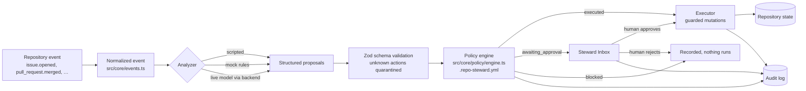

# Architecture

Repo Steward is organized so that everything with authority is shared, deterministic code, and everything with "intelligence" is a swappable analyzer behind one narrow interface.

## The pipeline

Every mode — scripted demo, deterministic mock, live AI, and the real-GitHub CLI — runs the same stages:

The load-bearing property: **analyzers return data, never perform actions.** An analyzer (including a live model) can emit any proposal it likes — the schema throws away anything outside the closed action union, the policy engine decides disposition, and the executor re-checks the non-negotiables before mutating anything.

## Layers

| Layer | Path | Runs in | Purpose |
| --- | --- | --- | --- |
| Core | `src/core/` | browser + Node | Event/proposal/analysis schemas, config schema + YAML + presets, glob path rules, line diffing, the policy engine, audit records. Zero DOM/Express dependencies. |
| Simulator | `src/sim/` | browser (Node in tests) | Typed repository state, seed fixture, mutations, the guarded executor, three analyzers, the run engine, persistence. |
| Web UI | `src/web/` | browser | GitHub-like repository experience; owns zero policy logic. |
| GitHub adapter | `src/github/` | Node | Webhook payload → normalized event, payload-only analyzer, dry-run + comments/labels executors, CLI. |
| Backend | `server/` | Node | Live AI proxy (keys stay server-side), config validation, GitHub dry-run endpoint. |

## Simulator state model

`src/sim/types.ts` defines a single `SimState` document persisted to `localStorage`:

- **Content-addressed files.** File bodies live once in `state.blobs` (hash → content); each branch holds a `tree` mapping path → hash. Historical PRs freeze their own base/head trees, so merged diffs stay stable while branches move. Creating the docs branch is a tree copy; a commit writes new blobs and updates the tree.
- **Entities.** Users, labels, branches, commits (per-branch ordered lists), issues, pulls (checks, reviews, inline comments), and per-target timelines share one issue/PR number space (`counters.number` starts at 48, so the steward's draft PR is #48).
- **Steward state.** Normalized events, stored proposals with lifecycle status, policy decision records, the append-only audit log, the applied config + YAML text, the current run (visible pipeline steps), and scenario checkpoints.
- **Checkpoints.** The engine snapshots state (minus the append-only blob store) *before* the run and after the analysis / policy / execution stages. "Jump to snapshot" restores those coherent states; "Reset current scenario" restores the pre-run snapshot; "Reset entire demo" rebuilds the seed.
- **Seed versioning.** `SEED_VERSION` is stored with the state; loading a save from an older fixture generation discards it instead of half-merging.

The store is storage-agnostic (`createSimStore(storage)`): the browser passes `localStorage`, unit tests pass an in-memory implementation — which is why scenario tests run headlessly in Vitest.

## The engine run

`src/sim/engine.ts` drives a run through seven visible stages (normalize → gather context → analyze → build proposals → evaluate policy → apply permitted actions → record audit). Each stage transition is a store update, so the UI renders live progress; per-stage latency is believable in `normal` mode and ~25 ms in `fast` mode (used by tests via the `repo-steward:latency` localStorage key).

Analyzer selection: `scripted` covers the three scenario targets and falls back to `mock` for anything else (e.g. an issue you just created); `mock` computes results from actual state; `live` builds a bounded context, POSTs `/api/analyze`, and validates the response client-side. A live failure marks the run failed and changes nothing.

## Where authority is enforced (twice)

1. **Policy engine** (`src/core/policy/engine.ts`) — pure function `(config, proposal, ctx) → decision` with ordered checks: global safety overrides → workflow-file protection → documentation path allow/deny + file/line limits → autonomy level + confidence thresholds. Every decision carries the config path, the thresholds applied, and a human-readable explanation.
2. **Executor** (`src/sim/executor.ts`) — the only code that mutates repository entities. It refuses, unconditionally: source modification, protected-branch pushes, merges. It re-validates config-gated stops (close/assign) and docs constraints at execution time, so an approved-but-stale or hand-forged proposal still cannot cross the line. `RealGithubExecutor` mirrors the same shape with an even smaller surface (comments + labels only).

## Backend

The backend is stateless; the simulator never depends on it. `/api/analyze` accepts `{event, context}` (Zod-validated, context bounded to 200 KB), calls the configured provider (Anthropic preferred; models via `ANTHROPIC_MODEL`/`OPENAI_MODEL`), parses and validates the JSON, retries once with a repair instruction, and returns typed errors (`not_configured`, `timeout`, `provider_error`, `refusal`, `truncated`, `invalid_output`) with no stack traces or secrets.
